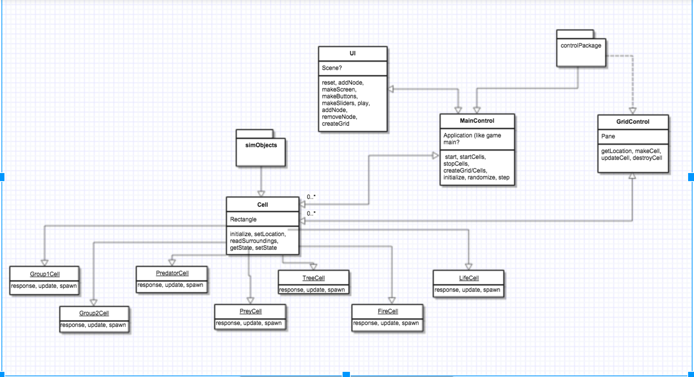
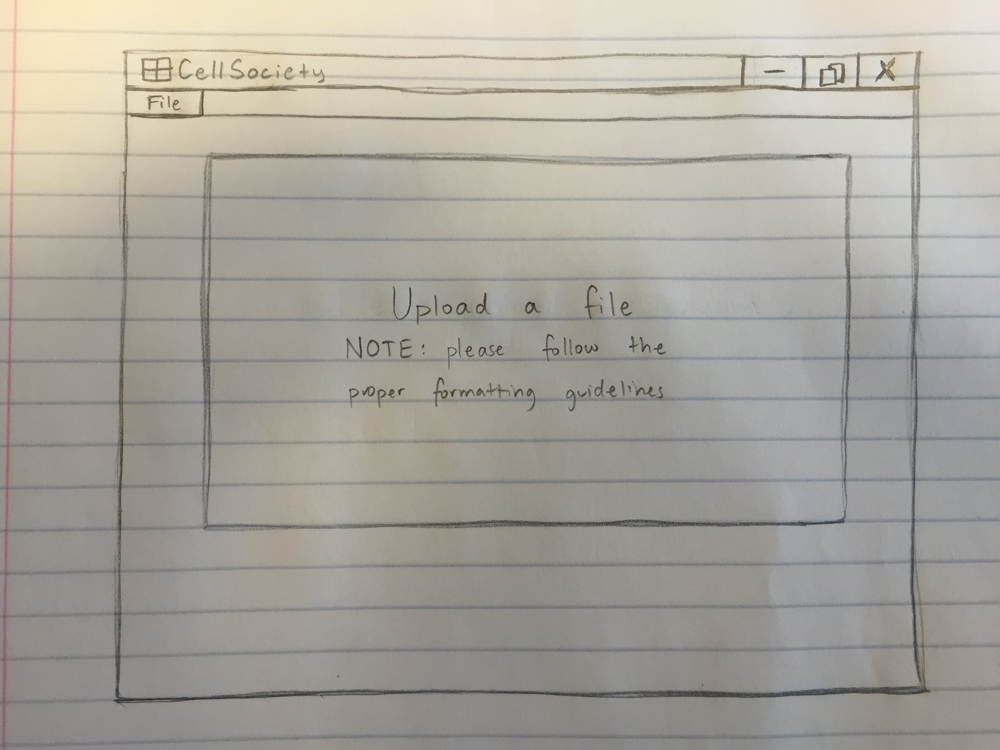
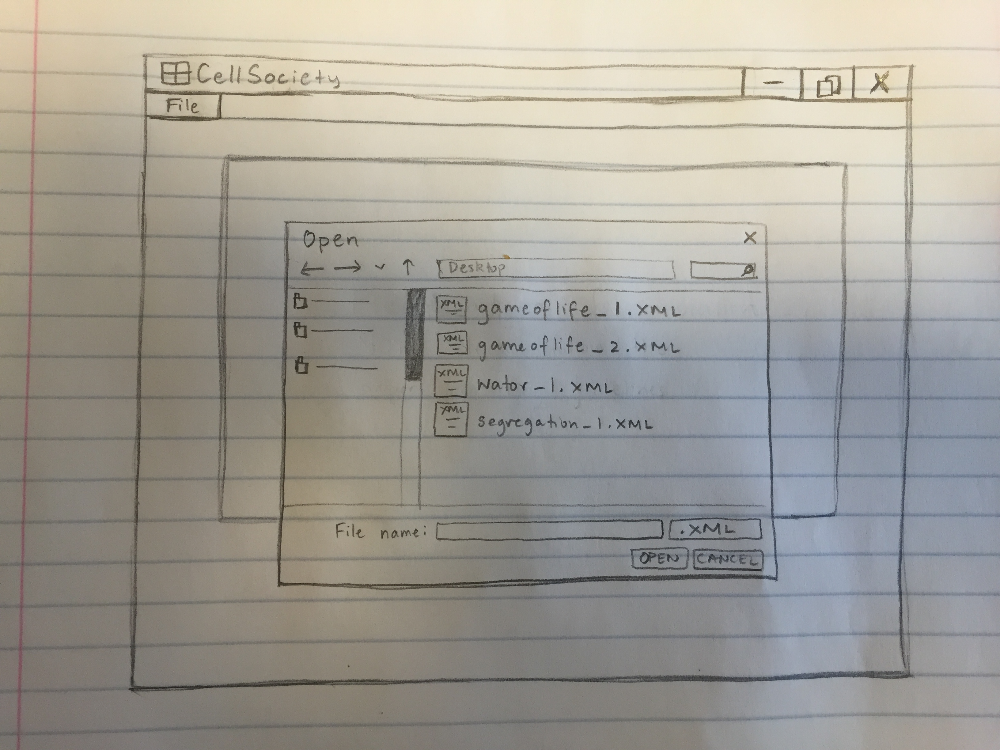
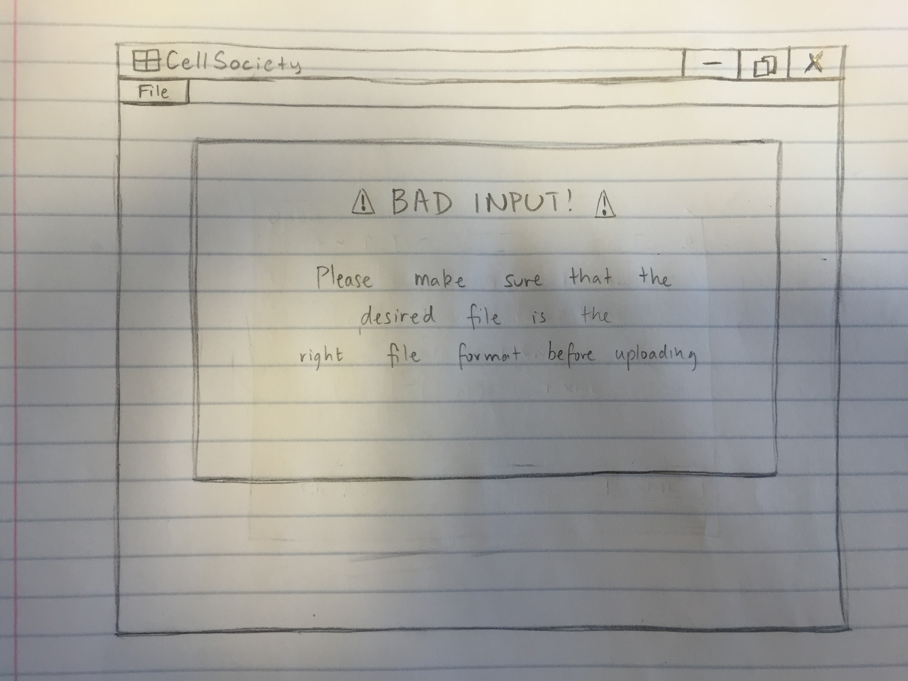
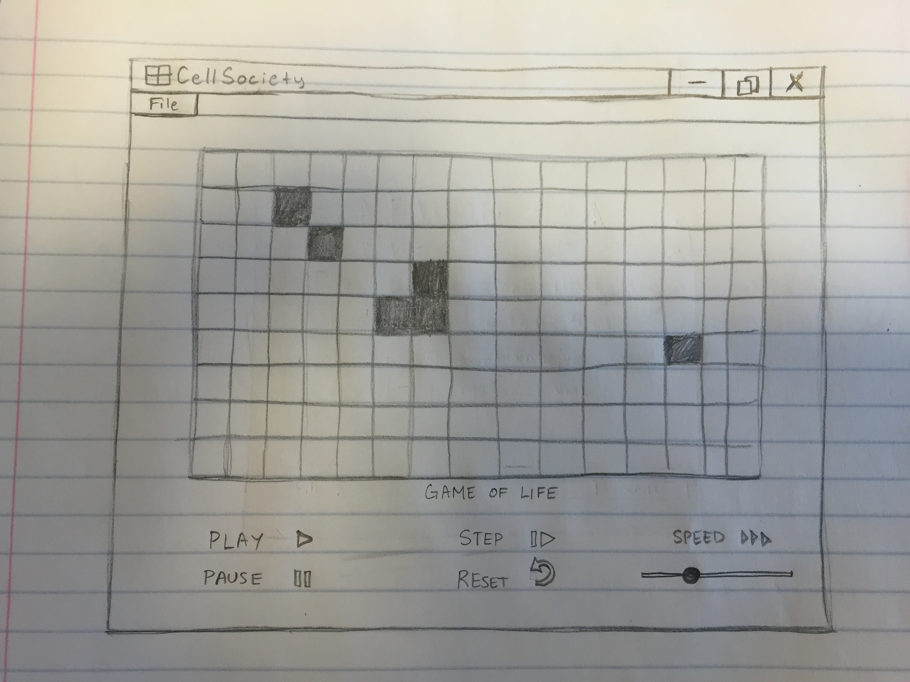

CS 308 Project 2: Cell Society Design
=========
Harry Guo, Michael Kuryshev, Aditya Srinivasan

Introduction
--------------
The problem our team is trying to solve with this program is designing a software application that a user can utilize to simulate interactions between entities in an environment. The primary design goals of the project are to ensure the program is flexible enough to allow users to specify the grid size and simulation parameters, switch simulations, choose rules, and add their own simulation. Another goal is to follow clean coding conventions so that the code is readable. The program will maintain an open implementation of a cell template so that various cell grid environments and cells can use information from the template. However, each of the specific cell environments created would be closed to modification. The UI would also be closed given that the interface between the user and the program does not need to change. Data regarding simulation parameters would be open for extension so that additional parameters can be implemented.

Overview
----------
The program was divided up into two distinct packages: one for cells and the second for user interface elements. The cells package contains classes for specific cells for a particular simulation falling under the general superclass Cell. The second is intended for user interface elements involving grid creation, file selection, and simulation controls. This was done to keep the way the user interacts with the program and the underlying functions that the program executes for simulation separate from each other.

The two separate packages are linked through the main class MainControl. Initially, it will call methods like start(), createGridCells(), and initialize() to communicate with the UI and GridControl classes to setup the initial configurations for the simulation. After this has been done, it further communicates with the Cell subclasses using methods such as response(), update(), and spawn() to update the behavior of each cell as specified by the appropriate rules and settings.

User Interface
----------------
The user interface will be a single window where users can load and execute simulations. In the upper toolbar there will be a button for users to open an XML file containing information about the simulation’s name, simulation parameters, initial settings, and grid size. The middle portion of the program window will contain the grid. Once an XML file has been loaded, the grid will update to the appearance of the specified simulation and initial settings. In the bottom portion of the window, there will be buttons to allow the user to play and pause the simulation, step forward in the simulation, reset the simulation, and additional sliders to control the speed of the simulation.

If the user uploads an incorrectly formatted XML file (i.e. another format or an XML without the proper tag names), the grid will display an error message indicating that the user must upload a valid file.

The picture below shows the welcome screen. There are no controls displayed and the user is allowed to select a file.

The picture below shows how the user opens a file. They select a local file from their computer.

The picture below shows the error message displayed when the user tries to upload an incorrectly formatted file.

The picture below shows the simulation running. The window displays the name of the simulation and controls to play, pause, step, and change the speed of the simulation.

Design Details
-----------------
The responsibilities of each component, including the handling of specific features and collaboration with other components, is detailed below.

>**MainControl** will extend Application --- This class coordinates the two separate classes. It listens for an uploaded file and distributes parsed XML values to the appropriate Java variables. After a file has been uploaded, it signals for the simulation to be established given the parameters in the XML file and controls the starting, pausing, and stepping of the simulation.

<i></i>

>**GridControl** --- After reading the XML information about grid sizes and initial conditions, this class will populate the grid cells with the starting states specified. It then communicates this information to MainControl which passes on useful information to the cell subclasses depending on the type of simulation desired. This class can be extended to accommodate for additional parameters being passed through the XML file by parsing for additional tags, without the existing module needing to be modified.

<i></i>

>**UI** --- This class is responsible for populating the user interface with buttons, dialogs, panes, and nodes that will generate the visual representations of the simulation. It communicates any button presses or mouse clicks with MainControl and GridControl which executes the appropriate function (change simulation, play, pause, step, etc.).

<i></i>

>**Cell** is a superclass for all kinds of cells --- This class contains the abstract method readSurroundings which allows a cell to determine the states of its neighbors and which kind of cell it is (edge/corner/middle) by counting surrounding cells. It also contains the abstract method getState which returns its own state to be read by other cells.

<i></i>

>**Cell subclasses (Group1Cell, Group2Cell, PredatorCell, PreyCell, TreeCell, FireCell, LifeCell)** --- Each of the subclasses will be able to respond to its surrounding neighbors’ states given a set of rules. These rules will be different for each subclass and dictated accordingly. If the need to implement additional simulations beyond the basic four is required, additional subclasses can be created that extend the Cell superclass without the need to modify any existing modules.

<i></i>

As mentioned, the one of the design’s key goals was to ensure that the program is flexible enough to allow users to specify parameters, switch simulations, and add their own. The current design allows this to be done and further allows extended requirements, such as additional simulation types or parameters, to be implemented fairly easily. Further, another goal was to achieve readability by following standard coding conventions to obtain clean code. Readability is also achieved by the separation of components into two distinct packages. This is due to the fact that many of the methods will be specific to the responsibilities of the package and not extend beyond these, eliminating the need for classes to execute confusing methods that seem to be inappropriate for its intended function.

The following illustrates how the components will handle different use cases:

>**Apply the rules to a middle cell: set the next state of a cell to dead by counting its number of neighbors using the Game of Life rules for a cell in the middle (i.e., with all its neighbors).** Assuming MainControl has determined which simulation to run, applying rules to a cell is a matter of communicating with the appopriate cell subclass. A cell will know if it is in the middle after running readSurroundings() and therefore the middle cells will have the rules applied to them. If the Game of Life rules are in play, the LifeCell will check how many neighbors it has by calling readSurroundings() and getState() on them and then set its own state using setState().

<i></i>

>**Apply the rules to an edge cell: set the next state of a cell to live by counting its number of neighbors using the Game of Life rules for a cell on the edge (i.e., with some of its neighbors missing).** Operating similar to the rules of a middle cell, a cell will obtain its location and then dependent on MainControl’s current simulation type, the GridControl will getLocation() and allow a cell to appropriately gather neighbors if it is at the maximum/minimum X/Y location on the grid.

<i></i>

>**Move to the next generation: update all cells in a simulation from their current state to their next state and display the result graphically.** To avoid a delay from one cell’s update to another’s, each cell will in parallel getState() whenever MainControl passes the step() or enough time passes in play(), with each cell knowing its own cell conditions and how to proceed, the GridControl will then run updateCells() to have each the grid’s cells setState() simultaneously.

<i></i>

>**Set a simulation parameter: set the value of a parameter, probCatch, for a simulation, Fire, based on the value given in an XML fire.** Once the XML file is read in and the UI runs createGrid(), the GridControl will updateCells() to pass along parameters to each Cell subclass while also modifying the parameters of the Cell superclass to specify the features of the cells and how they will operate.

<i></i>

>**Switch simulations: use the GUI to change the current simulation from Game of Life to Wator.** The UI class will feature a file section in which XML files are read in. Once a new file is selected, a current simulation will be reset, destroyCell() will remove the grid’s cells, and makeScreen() will run to set up for a new cell grid, at which point the Cell class will have run initialize() to set up for the new simulation type under the changed parameters.

Design Considerations
---------------------------

There are few issues that still need to be addressed:

>**How a cell’s rules are specified.** We have considered adding a class called GridRules in the main controller package. This will be beneficial since it can easily access rules specified from the XML. It makes it more difficult, however, to communicate these rules to the subclasses in the other package. Another option is for the cell to determine its own kind by counting how many neighboring cells it has (8 neighbours means it is a middle cell, 5 cells means it is an edge cell, 3 neighbors means it is a corner cell).

<i></i>

>**Methods within the cell subclasses.** We have yet to determine what the differences are between how each cell type will respond to various circumstances and so we are hesitant to specify methods for them. In addition, some methods may overlap between, say, fire and predator cells spreading to tree and prey cells respectively, and so we will wait until we have a working model to play with these methods.

<i></i>

>**MainControl being too controlling.** In the current design, MainControl coordinates much of the program. However, we do not want MainControl to be an unnecessary middleman for communication and not have any true function itself. A class that only coordinates is not required at all. One option is to remove main control and implement its functions throughout the other existing classes. This will eliminate the middleman and therefore make the code easier to read through without wondering the purpose of the class. However, the attribution of methods to other classes may be arbitrary and it could be unclear which class should hold a particular method leading to seemingly random choices that may not be the best choice.

Team Responsibilities
--------------------------

**Harry** will be responsible for designing the user interface along with Aditya, particularly focusing on how to open a dialog window for choosing a file using the JFileChooser feature.

**Aditya** will also be responsible for designing the user interface. He will also learn how to parse an XML file, handle the exceptions for bad inputs, and store values from the XML into Java variables given a good input.

**Michael** will work on the MainControl and GridControl classes to populate the grid with initial information once the XML has been passed through.

Once the initial implementation of the interface has been designed, the team members will work on the abstraction of the Cell superclass and the implementation of each subclass.

